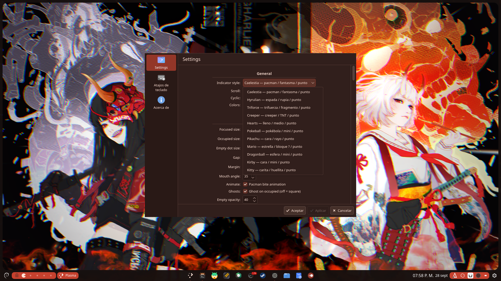
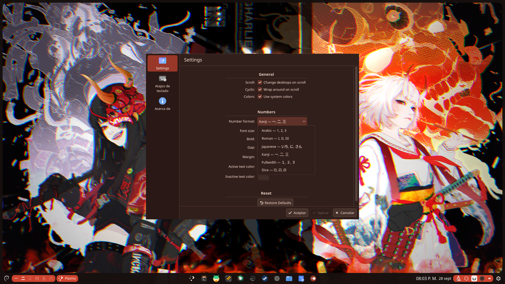

# Neko Desktops

Widgets para cambiar de escritorio en Plasma 6.

- **Neko Desktop**: con iconos, 11 estilos para elegir.
- **Kanji Desktop**: con texto, 6 formatos de números.

## Capturas (Neko Desktop)




## Capturas (Kanji Desktop)




## Instalar (súper fácil)

Opción 1 — 1 clic:
```bash
./install.sh
```

Opción 2 — desde Plasma:
1. Clic derecho en panel/escritorio → Añadir widgets → Obtener nuevos → Instalar desde archivo
2. Selecciona el `.plasmoid` del Release (o la carpeta `com.ezku.nekodesktop`)
3. Busca "Neko Desktop" o "Kanji Desktop" y añádelo

Opción 3 — manual:
```bash
cp -r com.ezku.nekodesktop ~/.local/share/plasma/plasmoids/
cp -r com.ezku.kanjidesktop ~/.local/share/plasma/plasmoids/
nohup plasmashell --replace >/tmp/plasmashell.log 2>&1 &
```

> No es un único archivo: cada plasmoide es una carpeta con varios `.qml` + `metadata.json`. El `install.sh` usa `kpackagetool6` para que sea 1 comando.

## Créditos

- Base: MikeDevQH (michaelqhdez@gmail.com)
- Fork y estilos Neko: ezku
- Licencia: GPLv3
